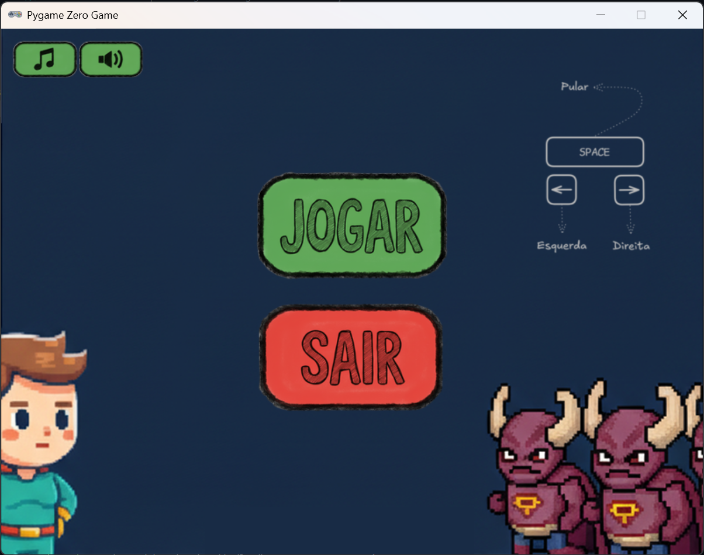
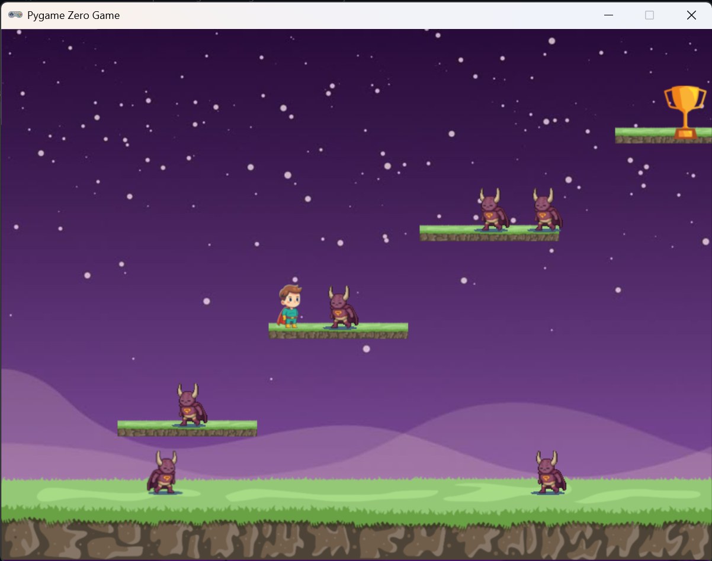

# Hero plataform game com PgZero

Este é um jogo de plataforma desenvolvido com PgZero.

## Pré-requisitos
- Python 3.x
- Pygame Zero (`pip install pgzero`)

## Instalação
1. Clone o repositório:
   ```bash
   git clone https://github.com/danzprogdanz/plataform-game-pgzero.git
   ```

2. Crie um ambiente virtual (opcional, mas recomendado):
   ```bash
   python -m venv .venv
   source .venv/bin/activate  # Linux/Mac
   .venv\Scripts\activate     # Windows
   ```

3. Instale as dependências:
   ```bash
   pip install pgzero
   ```

4. Execute o jogo:
   ```bash
   pgzrun main.py
   ```

## Screenshots





